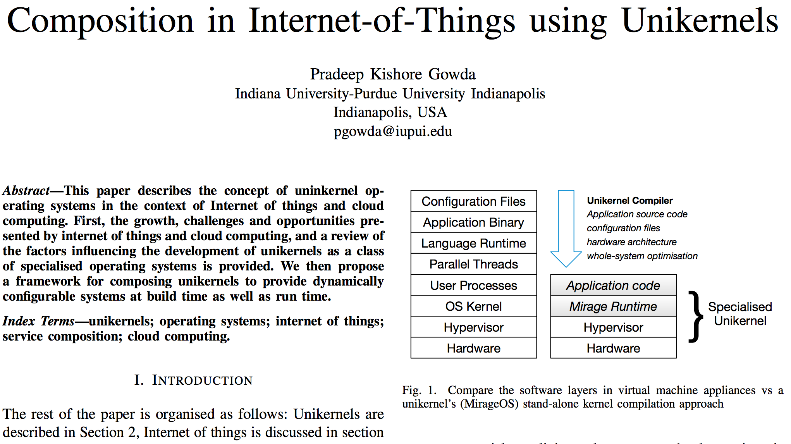
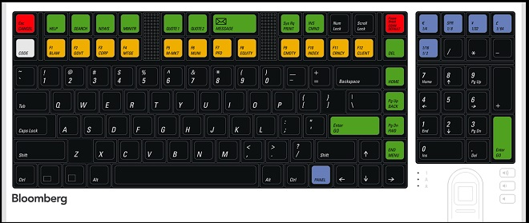
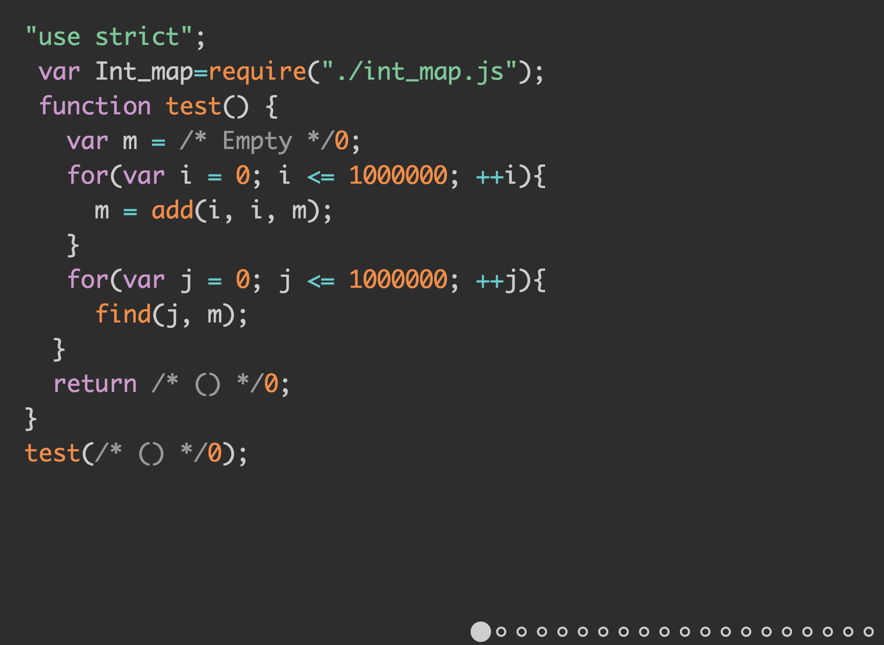

[.build-lists: true]


# ReasonML

## IndyJS, August 2017
### Pradeep Gowda <`@btbytes`>

---


[https://www.linkedin.com/in/btbytes/](https://www.linkedin.com/in/btbytes/)

---


# Q&A

---

## How many program in javascript regularly?

---


## What is the biggest Javascript codebase you have worked with:

    - 1000 lines
    - 5000 lines
    - 10,000 lines

---

## How many "program in more than 3 programming languages on a regular basis"

---

## How many of you have heard/programmed in ReasonML?

---

## How many of you know/program using React?


---

## The phrase "Static Typing" means ...

---

## The phrase "Functional Programming" means ...

---

## Tests remove the need for static types ...

1. yes
2. OF COURSE!
3. no
4. maybe

---

# [^_^]

---


---

# Complaints

> "there are five hundred thousand packages to capitalize the first letter of every word, and each of them have about fifty hundred thousand dependencies, each of which is in turn has about one line of code."

> etc., etc.,

-- [JavaScript for People Who Hate JavaScript](https://zachholman.com/posts/javacript-haters)

---

# React is cool, OMG


---


---

# Static Typing

---

# Functional Programming

---
# Tools to improve Javascript experience

---

# Flow

[Flow](https://flow.org/) is a static typechecker for Javascript


---

## Flow

<blockquote class="twitter-tweet" data-partner="tweetdeck"><p lang="en" dir="ltr">Flow helps me know JavaScript better, which makes me want something like ReasonML more.</p>&mdash; Aaron Shafovaloff (@aaronshaf) <a href="https://twitter.com/aaronshaf/status/897185954011594752">August 14, 2017</a></blockquote>
<script async src="//platform.twitter.com/widgets.js" charset="utf-8"></script>

---

## Prettier

> "Opinionated Code Formatter" for javascript

---

## BabelJS

> "The compiler for writing next generation JavaScript"

---

## Google Closure

> "The Closure Compiler compiles JavaScript into compact, high-performance code. The compiler removes dead code and rewrites and minimizes what's left so that it downloads and runs quickly. It also checks syntax, variable references, and types, and warns about common JavaScript pitfalls. These checks and optimizations help you write apps that are less buggy and easier to maintain."


---

# Taming the meta language


-- `<@_chenglou>`

---


---


[.build-lists: true]

# Compile to JS

- what are you talking about?
- I don't like them because ___
- I have used them, but ___

---

# [List of languages that compile to JS · jashkenas/coffeescript Wiki](https://github.com/jashkenas/coffeescript/wiki/list-of-languages-that-compile-to-js)


---

## [Scala.js](https://www.scala-js.org/)


---

[.build-lists: true]


## More mainstream(?)

* [Dart](https://www.dartlang.org/)
* [Typescript](https://www.typescriptlang.org/)

---

[.build-lists: true]

## More fun(?)

* [Elm](http://elm-lang.org/examples) --> ML/Haskellish. UI/Gaming focussed.
* [Purescript](http://www.purescript.org/) --> Haskellish language; multiple backends
* [Idris](https://www.idris-lang.org/) --> A Dependently Typed Functional Programming Language (Haskell/MLish)

---

* C/C++ --> [Emscripten](http://kripken.github.io/emscripten-site/); compile to asm.js
* **bucklescript** --> OCaml

---

[.build-lists: true]

# What is ReasonML

- Syntax and toolchain for OCaml
- Friendly toolchain on top of OCaml
- From the creator of React
- make it familiar to the Javascript developers.


---

# ReasonML compilation chain


---

# OCaml

- Originally known as *O*bjective *Caml*
- a derivative of ML with OOP extensions
- 20 years. Made in France
- has roots in [ML](https://en.wikipedia.org/wiki/ML_\(programming_language\))
- ... see also SML, F#


---

# OCaml

- Known for  [...see list...](https://github.com/rizo/awesome-ocaml)
- Operating systems
- Compilers
- Formal verification tools (eg: [Compcert](http://compcert.inria.fr/))
- Static Code analysis (eg: [Frama-C](https://frama-c.com/))
- Coq - formal proof management system.


---

# Real World OCaml


- O'Reilly book
- Free to read online
- [website](https://realworldocaml.org/v1/en/html/index.html)

---

## OCaml in the "news"

---


###  Hack PHP compiler

[Hack](http://hacklang.org/)


---


[src](https://www.quora.com/Why-did-Facebook-build-the-hack-typechecker-in-OCaml)

---

## Flow

> "Using data flow analysis, Flow infers types and tracks data as it moves through your code. You don't need to fully annotate your code before Flow can start to find bugs."

OCaml provides:

- Algebraic data types
- Pattern matching (operate on Abstract syntax trees)
- Statically typed

---

### Rust

- compiler originally written in OCaml (`rustboot`)
- See [Hey! There's OCaml in my Rust!](https://www.slideshare.net/KelCecil/hey-theres-ocaml-in-my-rust)

---

### MirageOS

> "is a library operating system that constructs unikernels for secure, high-performance network applications across a variety of cloud computing and mobile platforms."

---

# Unikernels

> "Unikernels are specialised, single-address-space machine images constructed by using library operating systems."


---



---


---


---

# Bucklescript

- https://bucklescript.github.io/
- **BuckleScript: write JS faster, safer and smaller**
- Created at Bloomberg
- Compiles OCaml to Javascript
- [Playground](https://bucklescript.github.io/bucklescript-playground/)



---

# What problems does Bucklescript solve?

**BuckleScript is mainly designed to solve the problems of large scale JavaScript programming**

---


## Type safety

> "No verbose type annotation required compared with TypeScript".

> "a **sound** type system which means it is guaranteed that there will be no runtime type errors after type checking."

---

## High quality dead code elimination

- Function and module level elimination
- bundle tools like [Google Closure](https://developers.google.com/closure/)


---

##  Fast compilation


S=scala, K=kotlin, TS=typescript.

---

## More efficient code

---

## Small JS output

- In BuckleScript, a Hello world program generates **20 bytes** JS code instead of 50K bytes.

---

## Maintain code structure

- One-to-one mapping between Buckclescript(Reason) -> Javascript output.

---

### Readable javascript output

---


[source](https://github.com/MarcelCutts/Reason-Talk)

---



[source](https://github.com/MarcelCutts/Reason-Talk)

---

## [Why Bucklescript matters for Javascript platform](https://github.com/BuckleScript/bucklescript/wiki/Why-bucklescript-matters-for-Javascript-platform)

---

# ReasonML

---

# Quickstart

[Quickstart](https://reasonml.github.io/guide/javascript/quickstart)

```
npm install -g bs-platform
bsb -init my-first-app -theme basic-reason

cd my-first-app
npm run build

node lib/js/src/demo.js
```

---

# [...jump to Code...]

---

# Syntax

- <https://reasonml.github.io/guide/language/overview>

---

## Code Optimization

ReasonML:

```
let muli a b => a * b;
```

JS:

```javascript
var Caml_int32 = require("stdlib/caml_int32");
var muli = Caml_int32.imul;
```

---

## Code optimization (2)


```javascript
let y = [|1, 2, 3, 4, 5|];

let twice x => x * 2;

Array.map Js.log (Array.map twice y);

y |> Js.Array.filter (fun x => x > 2)
  |> Js.Array.filter (fun x => x % 2 == 0)
  |> Js.log;
```

---

# Playing with ReasonML

---

# Playground

- [https://reasonml.github.io/try](https://reasonml.github.io/try)


- [codepan](https://codepan.net/gist/c7f94a5d834d8c4a9e4fd2bc46b26dd7)

---

# Visual Studio Code

<blockquote class="twitter-tweet" data-partner="tweetdeck"><p lang="en" dir="ltr">Been coding <a href="https://twitter.com/reasonml">@reasonml</a> on <a href="https://twitter.com/code">@code</a>. Loving it so much have made a full switch away from atom.</p>&mdash; Sean Matheson (@controlplusb) <a href="https://twitter.com/controlplusb/status/897428833904848896">August 15, 2017</a></blockquote>
<script async src="//platform.twitter.com/widgets.js" charset="utf-8"></script>

---

# Where is it used?

- over quarter of the code on [messenger.com](https://www.messenger.com/)

---

# React-Reason

- [Reason bindings for ReactJS](https://github.com/reasonml/reason-react) [docs](https://reasonml.github.io/reason-react/)

> It integrates deeply with language level features in order to create an expressive, statically typed API, packed into a tiny API surface area.
> By binding directly to ReactJS, ReasonReact gives you access to the entire React ecosystem, so that you can adopt it incrementally.

- [example project](https://github.com/reasonml-community/reason-react-example) -- https://github.com/reasonml-community/reason-react-example


---


# Thank you

## Questions?
